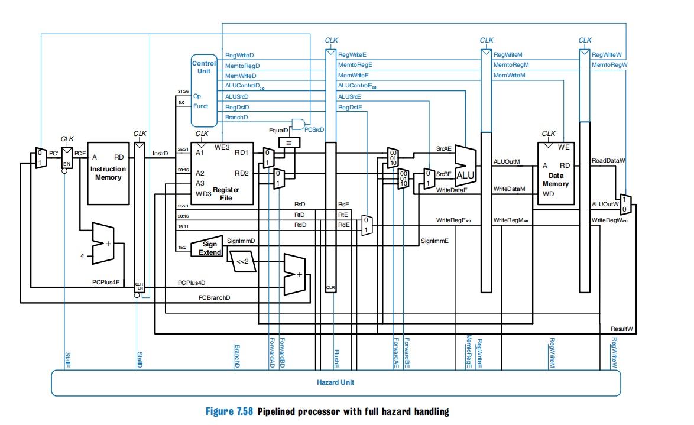

# PiplinedMIPSCPU

更加进阶的MIPS CPU设计，全新版本，旅行者准备好了吗？

## 项目结构

参照上图进行设计

将指令存储器和主存分开，并且独立cpu之外。

cpu中和之前一样包括两个部分，datapath和controlpath（把控制信号和分隔寄存器搞在一起了，不知道叫什么就叫这个）。核心思想还是控制平面和数据平面的分离，SDN串台（

其他就不多说了。如何设计的具体参照参考书目。

[rtl图参考](./pipline.pdf)

### jump指令

这个指令的设计原书上是作为习题给出的，我这里顺手实现了一下，其实实现起来很简单，直接参照多周期cpu的设计来实现的。控制单元额外输出一个jump信号，然后PC输入的时候多路选择一下就行
