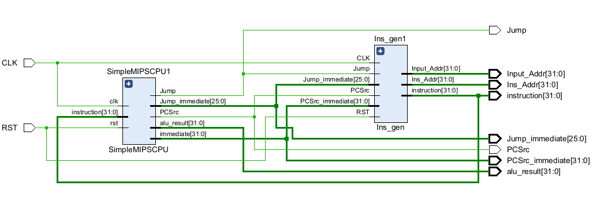
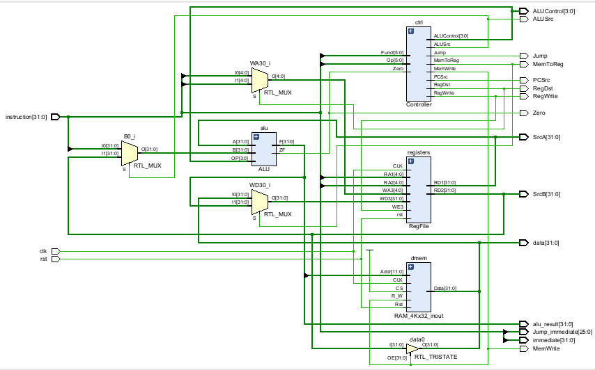
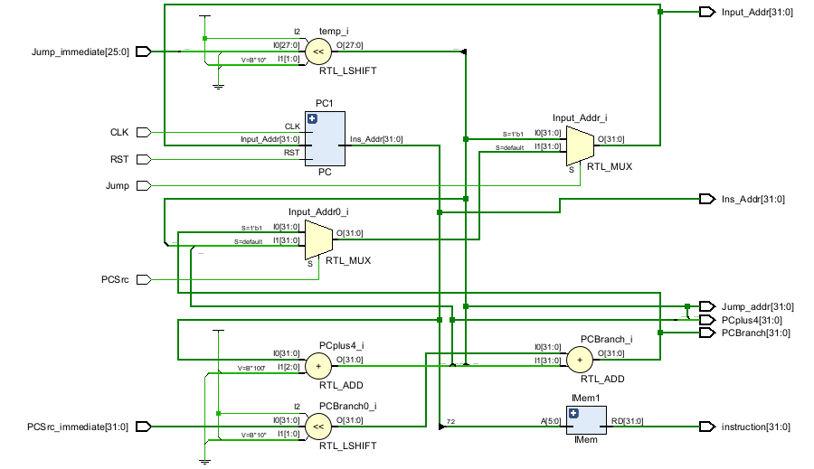

# SimpleMIPSCP Version 0.0.0U

Hello traveller!

## 项目结构

### scripts

实验使用的脚本和数据，主要有：

- as.py:汇编器，把test.asm的汇编代码编译成二进制机器码
- reg_init.py:生成寄存器初始化文件

### src

实验源码，test下是testbench

要用的话指令存储器，寄存器和主存的初始化记得改才能用。

## 顶层模块

调用了两个下级模块SimpleMIPSCPU和Ins_gen（指令生成相关）

[顶层模块 computer.v](./src/computer.v)

rtl分析图如下

### 模块SimpleMIPSCPU

[SimpleMIPSCPU](./src/SimpleMIPSCPU.v)

这个模块是CPU的主要部分，整个代码参照的是课程ppt的代码，所以你可以在CPU里面看到指令存储器和主存。模块组织烂完了😂

### 指令生成Ins_gen

[Ins_gen](./src/Ins_gen.v)

按照给的代码写好cpu就差指令发生器了

### 剩下的小模块自己看看得了，写到这里了小模块之前肯定写过了

## 这个版本的问题

这一版的cpu设计十分的草率，一开始设计的时候没有看到参考数目上的下面这张图，导致的模块乱分，用dbd的话来说就是存算一体😂

对此在Version 1.0.0中做出了修改。
